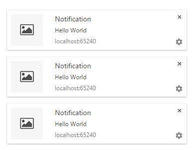

# Angular Desktop Notifications
-----
Angular Desktop Notifications helps provide desktop notification for your angular application through a very simple api without any Jquery dependencies.
And it only adds ~40 lines to your project.

## Screenshot
-----


## Installing
-----
 - Use `bower` or `git clone` to download the module.
   - `bower install angular-desktop-notification`
   - `git clone https://github.com/kaushiksamanta/angular-desktop-notification.git`
 - include `angular-desktop-notification.module.js` from src folder.
 - Inject angular-desktop-notification into your angular module and inject Notification factory into your controller.

## In your html/template add
-----
```html
  <script src="bower_components/src/angular-desktop-notification.module.js"></script>
```

## In your application, declare dependency injection like so..
-----
```javascript
  angular.module('notificationTest', ['angular-desktop-notification']);
```

## You can call the module by
-----
```javascript
angular.module('notificationTest')
    .controller('notificationController', function($scope, Notification) {
        Notification.initialize('src/dummy.png');
        $scope.pop = function() {
          Notification.notify($scope.text,'Notification');
        }
    });
```

## Methods
-----
 - `Notification.initialize('src/dummy.png')` - Initialises the notification with icon.
 - `Notification.notify('body','Title')` - Pops the notification with title and body as argument.

## Browser Support
-----
Works best on latest versions of Google Chrome, Firefox and Safari.
